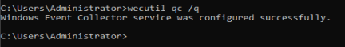
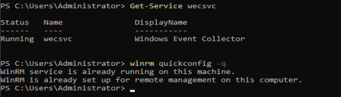
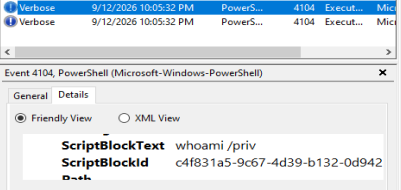

# Lab 07: Windows Event Forwarding (WEF) & Centralized Collector Setup

## Overview
This lab details the configuration of Windows Event Forwarding (WEF) in `corp.local`. Establishing WEF creates a centralized log collection architecture that automatically forwards endpoint security telemetry—including Process Creation (Event ID 4688) and PowerShell Script Execution (Event ID 4104)—from domain-joined clients to a central Windows Event Collector (WEC) server without requiring third-party agents.

---

## Technical Specifications

| Parameter | Configuration |
| :--- | :--- |
| **WEC Collector Server** | `CORP-DC01.corp.local` (`192.168.1.10`) |
| **Source Client (Forwarder)** | `CORP-WIN10.corp.local` (`192.168.1.50`) |
| **Forwarding Protocol** | WinRM (HTTP/5985) via Kerberos Authentication |
| **Subscription Type** | Source-Initiated (Push Subscription) |
| **Target Security Group** | `CorpObjects/Groups/Domain Computers` |
| **Destination Log** | `Forwarded Events` |

---

## WEF Architecture

```text
[ CORP-WIN10 ] (Domain Endpoint)
      │
      │ 1. Local Events (4688, 4104) written to Security/Operational logs
      │ 2. WinRM / WinRM Listener evaluates WEC Subscription
      ▼
   ( WinRM / HTTP 5985 - Kerberos Encrypted )
      │
      ▼
[ CORP-DC01 ] (Windows Event Collector)
      └── Received Events stored in: ForwardedEvents.evtx
```

---

## Step-by-Step Configuration

### Phase 1: Configure WEC Collector Service on `CORP-DC01`
1. Log in to `CORP-DC01` as `CORP\Administrator`.
2. Open **Command Prompt as Administrator** or **PowerShell**.
3. Initialize the Windows Event Collector service and set its startup type to Automatic:
   ```cmd
   wecutil qc /q
   ```
   
4. Verify the `wecsvc` service is running:
   ```powershell
   Get-Service wecsvc
   ```

---

### Phase 2: Configure WinRM Listener & Network Permissions
1. Enable WinRM on `CORP-DC01` to allow source-initiated connections:
   ```cmd
   winrm quickconfig -q
   ```
   
   
2. Grant the **Network Service** account read permissions to the Security log on forwarders (enforced via GPO or local configuration):
   * Open `gpmc.msc` and edit `GPO_Workstation_Audit_Policy`.
   * Navigate to `Computer Configuration` -> `Policies` -> `Windows Settings` -> `Security Settings` -> `Restricted Groups`.
        1. Right click the empty pane to the right.
        2. Select 'Add Group'
        3. Click 'Browse...', type 'Event Log Readers', click 'Check Names', and click OK.
           
    * Ensure `Event Log Readers` includes `NT AUTHORITY\Network Service` and `CORP\Domain Computers`.
        1. Double Click the 'Event Log Readers' group that was just added in the window.
        2. Look at the top section labeled Members of this group: and click Add....
        3. Add the `CORP\Domain Computers` member to this group
        4. Near the `From this location` entry field select the `Locations...` button.
        5. Select the local machine on top of the tree >> `Advanced...` >> click OK.
        6. In the Field for `Enter the object names to select (examples):` type `NETWORK SERVICE` and select `Check Names`. If `NT AUTHORITY\Network Service` appears then click OK.
         
---

### Phase 3: Create Source-Initiated Subscription on `CORP-DC01`
1. Open **Event Viewer** (`eventvwr.msc`) on `CORP-DC01`.
2. Right-click **Subscriptions** in the left pane -> select **Create Subscription...**.
3. Configure the subscription properties:
   * **Subscription Name:** `CorpNet-Security-ForwardedEvents`
   * **Target Log:** `Forwarded Events`
   * **Subscription Type:** Select **Source computer initiated** -> click **Select Computer Groups...**.
   * In the Computer Groups window, click **Add Domain Computers** -> type `Domain Computers` -> click **OK**. Click **OK** again to be back at the Subscription Properties window.
4. Click **Select Events...** to define the telemetry filter:
   * Select **By log**.
   * Under **Event logs**, check `Windows Logs\Security` and `Applications and Services Logs\Microsoft\Windows\PowerShell\Operational`
   * In the `<All Event IDs>` field, enter: `4688, 4104, 4624, 4625`.
   * Click **OK**.
5. Click **Advanced...**:
   * Set **Event Delivery Optimization:** `Minimize Latency` (forces real-time 30-second delivery for lab testing).
   * Click **OK** twice to save the subscription.

---

### Phase 4: Configure Forwarding GPO for Workstations
1. On `CORP-DC01`, open `gpmc.msc`.
2. Create a new GPO named `GPO_WEF_Forwarding_Policy` and link it to `CorpObjects/Workstations`.
3. Right-click `GPO_WEF_Forwarding_Policy` -> select **Edit...**.
4. Navigate to: `Computer Configuration` -> `Policies` -> `Administrative Templates` -> `Windows Components` -> `Event Forwarding`.
5. Double-click **Configure target Subscription Manager**:
   * Set to **Enabled**.
   * Click **Show...** under Subscription Managers.
   * Add the collector connection string (pointing to `CORP-DC01` over port 5985):
     ```text
     Server=[http://CORP-DC01.corp.local:5985/wsman/SubscriptionManager/WEC,Refresh=60](http://CORP-DC01.corp.local:5985/wsman/SubscriptionManager/WEC,Refresh=60)
     ```
   * Click **OK**.
6. Navigate to: `Computer Configuration` -> `Policies` -> `Administrative Templates` -> `Windows Components` -> `Windows Remote Management (WinRM)` -> `WinRM Service`.
7. Double-click **Allow remote server management through WinRM**:
   * Set to **Enabled**.
   * Set IPv4 filter to `*` (or `192.168.1.0/24`).

---

### Phase 5: Start and Configure WinRM via GPO to run automatically
1. On `Corp-DC01` open Group Policy Management Editor for `GPO_WEF_Forwarding_Policy`.
2. Navigate to `Computer Configuration` >> `Policies` >> Windows Settings >> Security Settings >> System Services.
3. Double-click Windows Remote Management (WS-Management) in the right pane.
4. Check `Define this policy setting` and then select `Automatic`
5. Click Apply and then OK.

---

### Phase 6: Force Client Policy & Validate Telemetry Forwarding
1. Switch to `CORP-WIN11` logged in as `CORP\jdoe`.
2. Open **Command Prompt as Administrator** and update group policy:
   ```cmd
   gpupdate /force
   ```
3. Verify WinRM service status on client:
   ```powershell
   Get-Service WinRM
   ```
4. Generate test telemetry on `CORP-WIN10`:
   ```powershell
   whoami /priv
   ```
5. Switch back to `CORP-DC01`:
   * Open **Event Viewer** -> expand **Windows Logs** -> click **Forwarded Events**.
   * Confirm events from `CORP-WIN10.corp.local` appear with **Event ID 4688** and **Event ID 4104**.

  Expected Forwarded Log output:
  
  
  
---

## Troubleshooting & Common Pitfalls

### Issue: Subscription Status Shows "0 Computers Active"
* **Root Cause:** Client endpoints cannot resolve the Subscription Manager URL or WinRM HTTP port 5985 is blocked by host firewall.
* **Resolution:**
  1. Verify DNS resolution from `CORP-WIN10`:
     ```cmd
     nslookup CORP-DC01.corp.local
     ```
  2. Test TCP port 5985 connectivity from client:
     ```powershell
     Test-NetConnection -ComputerName CORP-DC01.corp.local -Port 5985
     ```
  3. Ensure Windows Firewall on `CORP-DC01` allows inbound connections on TCP 5985 (Windows Remote Management - HTTP-In).

### Issue: Access Denied on Security Log Forwarding
* **Root Cause:** The `Network Service` or `Event Log Readers` account lacks permissions to read the client's Security channel (`CustomSD`).
* **Resolution:** On `CORP-WIN10`, add `NT AUTHORITY\Network Service` to the built-in `Event Log Readers` local group:
  ```cmd
  net localgroup "Event Log Readers" "NT AUTHORITY\Network Service" /add
  ```

---

## Verification & Key Takeaways
* [x] WEC service initialized on `CORP-DC01` (`wecutil qc`).
* [x] Source-initiated subscription `CorpNet-Security-ForwardedEvents` created targeting `Domain Computers`.
* [x] Subscription Manager URL deployed to endpoints via `GPO_WEF_Forwarding_Policy`.
* [x] Centralized log ingestion confirmed: `CORP-WIN10` events (4688/4104) successfully rendering in `CORP-DC01`'s **Forwarded Events** log.

**Next Phase:** Lab 08 — Open-Source SOC Telemetry Pipeline & Threat Detection Testing.
