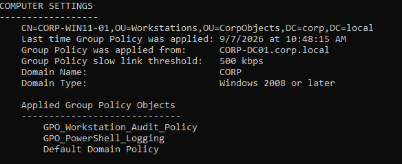
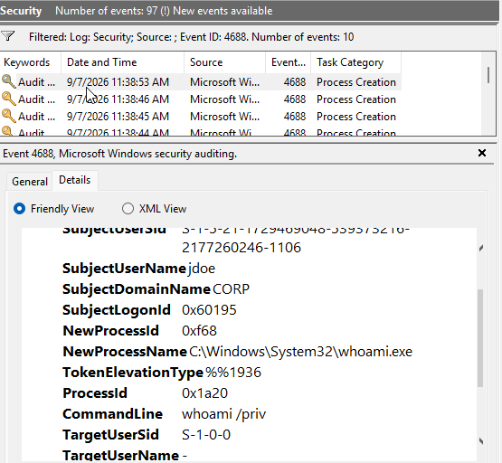

# Lab 06: Group Policy Object (GPO) Deployment & Security Auditing Baselines

## Overview
This lab covers the creation, configuration, and enforcement of Active Directory Group Policy Objects (GPOs) across `corp.local`. Establishing centralized group policies enforces essential Endpoint Detection and Response (EDR) telemetry baselines—including Advanced Audit Policy Configuration, PowerShell Script Block Logging, and automated deployment of System Monitor (Sysmon) for threat visibility.

---

## Technical Specifications

| Parameter | Configuration |
| :--- | :--- |
| **Domain Controller** | `CORP-DC01.corp.local` (`192.168.1.10`) |
| **Target Organizational Unit** | `CorpObjects/Workstations` & `CorpObjects/Servers` |
| **Group Policies Created** | `GPO_Workstation_Audit_Policy`, `GPO_PowerShell_Logging` |
| **Monitored Endpoints** | `CORP-WIN11` (Windows Enterprise Client) |
| **Target Event IDs** | 4624 (Logon), 4688 (Process Creation), 4104 (PowerShell Script Block) |

---

## Group Policy Architecture

```text
corp.local
└── CorpObjects/
    ├── Workstations/  <-- Linked: GPO_Workstation_Audit_Policy, GPO_PowerShell_Logging
    │   └── CORP-WIN10
    └── Servers/       <-- Linked: GPO_Workstation_Audit_Policy
        └── CORP-DC01
```

---

## Step-by-Step Configuration

### Phase 1: Configure Advanced Audit Policy via Group Policy
1. Log in to `CORP-DC01` as `CORP\Administrator`.
2. Open **Group Policy Management Console** (`gpmc.msc`).
3. Expand `Forest: corp.local` -> `Domains` -> `corp.local` -> right-click **Group Policy Objects** -> select **New**.
4. Name the policy `GPO_Workstation_Audit_Policy` and click **OK**.
5. Right-click `GPO_Workstation_Audit_Policy` -> select **Edit...** to open the **Group Policy Management Editor**.
6. Navigate to: `Computer Configuration` -> `Policies` -> `Windows Settings` -> `Security Settings` -> `Advanced Audit Policy Configuration` -> `Audit Policies`.
7. Configure the following sub-categories for **Success** and **Failure**:
   * **Account Logon:** Audit Kerberos Authentication Service, Audit Credential Validation.
   * **Account Management:** Audit User Account Management.
   * **Detailed Tracking:** Audit Process Creation (include Command Line in Process Creation Events).
   * **Logon/Logoff:** Audit Logon, Audit Logoff, Audit Account Lockout.
   * **Object Access:** Audit File System, Audit Registry.
   * **System:** Audit Security State Change, Audit System Integrity.
8. Enable Command-Line Process Auditing:
   * Navigate to `Computer Configuration` -> `Policies` -> `Administrative Templates` -> `System` -> `Audit Process Creation`.
   * Double-click **Include command line in process creation events** -> select **Enabled** -> click **OK**.

---

### Phase 2: Enable PowerShell Script Block & Module Logging
1. In `gpmc.msc`, right-click **Group Policy Objects** -> create a new GPO named `GPO_PowerShell_Logging`.
2. Right-click `GPO_PowerShell_Logging` -> select **Edit...**.
3. Navigate to: `Computer Configuration` -> `Policies` -> `Administrative Templates` -> `Windows Components` -> `Windows PowerShell`.
4. Configure the following policies:
   * **Turn on PowerShell Script Block Logging:** Set to **Enabled** (Captures code blocks executed by scripts and interactive shell commands into Event ID 4104).
   * **Turn on Module Logging:** Set to **Enabled** -> click **Show...** -> enter `*` under Module Names to log all execution modules.
   * **Turn on PowerShell Transcription:** Set to **Enabled** (Optionally specify a centralized log directory).

---

### Phase 3: Link GPOs & Enforce Policy Updating
1. In **Group Policy Management Console** (`gpmc.msc`), navigate to `corp.local` -> `CorpObjects` -> `Workstations`.
2. Right-click the `Workstations` OU -> select **Link an Existing GPO...**.
3. Select `GPO_Workstation_Audit_Policy` and click **OK**. Repeat the process to link `GPO_PowerShell_Logging`.
4. Switch to the `CORP-WIN10` client VM logged in as `CORP\jdoe`.
5. Open **Command Prompt** or **PowerShell** as Administrator and force an immediate Group Policy update:
   ```cmd
   gpupdate /force
   ```
6. Verify applied policies on the client:
   ```cmd
   gpresult /scope computer /r
   ```
   Confirm `GPO_Workstation_Audit_Policy` and `GPO_PowerShell_Logging` are listed under **Applied Group Policy Objects**.

***You should see this as a command line result:***



---

### Phase 4: Validate Telemetry Generation
1. **Test Process Creation & Command-Line Logging:**
   * On `CORP-WIN10`, open PowerShell and execute a test command:
     ```powershell
     whoami /priv
     Get-Process
     ```
2. **Verify Event Logs:**
   * Open **Event Viewer** (`eventvwr.msc`).
   * Navigate to `Windows Logs` -> `Security`.
   * Filter for **Event ID 4688** (Process Creation) and verify the command-line field displays `whoami /priv`.
3. **Verify PowerShell Logging:**
   * In Event Viewer, navigate to `Applications and Services Logs` -> `Microsoft` -> `Windows` -> `PowerShell/Operational`.
   * Look for **Event ID 4104** (Script Block Logging) to confirm raw code block capture.

***You Should see something like this in Event Viewer for the Applications and Services Logs:***



---

## Troubleshooting & Edge Cases

### Issue: Client Audit Policy Displays "No Auditing" After `gpupdate /force`
* **Symptom:** `auditpol /get /subcategory:"Process Creation"` returns `No Auditing` on the client endpoint (`CORP-WIN10`), and Event ID 4688 logs fail to generate despite GPO link confirmation.
* **Root Cause:** Legacy local security policy settings overrides or stale local audit policy caching (`audit.csv`) on the client endpoint preventing AD GPO subcategories from applying.
* **Resolution:**
  1. On **`CORP-DC01`**, navigate to `GPO_Workstation_Audit_Policy` -> `Computer Configuration` -> `Policies` -> `Windows Settings` -> `Security Settings` -> `Local Policies` -> `Security Options` and set **Audit: Force audit policy subcategory settings to override audit policy category settings** to **Enabled**.
  2. On **`CORP-WIN10`**, open an elevated Command Prompt and execute the following commands to flush the local audit policy cache and force fresh domain enforcement:
     ```cmd
     auditpol /clear /y
     gpupdate /force
     ```
  3. Verify successful policy application:
     ```cmd
     auditpol /get /subcategory:"Process Creation"
     ```
     *Output should display `Success and Failure`.*

## Verification & Key Takeaways
* [x] Centralized GPOs created for Advanced Security Auditing and PowerShell logging.
* [x] Policies linked to target Organizational Units (`CorpObjects/Workstations`).
* [x] Configured Advanced Audit Override setting to prevent legacy policy conflicts.
* [x] Flushed local audit cache (`auditpol /clear /y`) and refreshed endpoint via `gpupdate /force`.
* [x] Verified `Process Creation` subcategory set to `Success and Failure`.
* [x] Command-line process telemetry (Event ID 4688) and PowerShell script execution (Event ID 4104) verified in Windows Event Viewer / `Get-WinEvent`.

**Next Phase:** Lab 07 — Windows Event Forwarding (WEF) & Centralized Log Collector Setup.
